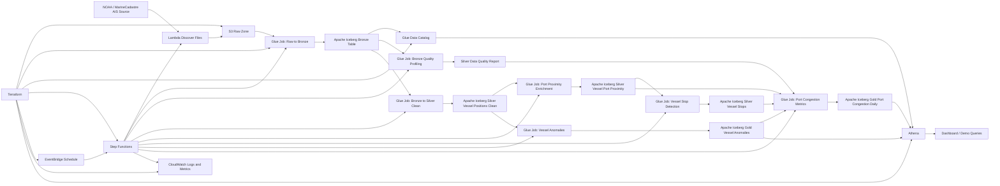

# HarborWatch AWS Target Architecture

## Purpose

This is the target AWS lakehouse architecture for HarborWatch.

The local MVP already validates the core data logic using CSV files. This architecture moves the same flow into AWS using S3, Glue, Apache Iceberg, Glue Data Catalog, Athena, Step Functions, EventBridge, CloudWatch, IAM, and Terraform.

## Data Flow

1. AIS data is discovered from NOAA / MarineCadastre.
2. Raw files are stored in the S3 Raw Zone.
3. AWS Glue standardizes raw AIS records into Bronze Iceberg tables.
4. Data quality profiling produces a Silver quality report.
5. Valid vessel positions are written to Silver Iceberg tables.
6. Geospatial enrichment calculates nearest port and port radius flags.
7. Vessel stop episodes are detected near ports.
8. Gold tables are created for port congestion and vessel anomalies.
9. Athena queries Gold tables for analysis and dashboard consumption.
10. Step Functions orchestrates the pipeline.
11. EventBridge schedules the pipeline.
12. CloudWatch captures logs and execution metrics.
13. Terraform provisions infrastructure.

## Target AWS Services

- Amazon S3
- AWS Glue
- AWS Glue Data Catalog
- Apache Iceberg
- Amazon Athena
- AWS Step Functions
- AWS Lambda
- Amazon EventBridge
- Amazon CloudWatch
- IAM
- Terraform
- GitHub Actions

## Initial AWS MVP Scope

The first AWS deployment should only include:

- S3 buckets/prefixes for Raw, Bronze, Silver, and Gold
- Glue Data Catalog database
- Glue jobs for Raw to Bronze, Bronze to Silver, and Silver to Gold
- Athena workgroup or output location
- Step Functions state machine
- EventBridge schedule
- CloudWatch logs
- IAM roles with least-privilege simplified policies

## Out of Scope for First AWS MVP

The following are intentionally excluded from the first AWS deployment:

- Kubernetes
- Real-time streaming
- MWAA / Airflow
- Redshift Serverless
- Complex dashboard frontend
- Machine learning anomaly detection
- More than 1 to 7 days of AIS data
- More than the five MVP ports

## Trade-offs

### Batch instead of streaming

AIS data can be processed in batch for this MVP. Streaming would add complexity without improving the portfolio signal enough at this stage.

### Glue instead of EMR

Glue is simpler to operate for an MVP and integrates directly with S3, Iceberg, Data Catalog, and Athena.

### Athena instead of Redshift

Athena is sufficient for querying Iceberg tables in the MVP. Redshift Serverless can be considered later if interactive BI performance becomes a real bottleneck.

### Step Functions instead of Airflow

Step Functions is lighter and easier to deploy for this scope. Airflow would be overkill for the MVP.

### Point-radius ports instead of polygons

The MVP uses port coordinates and a 20 km radius. Real production logic should use port polygons, terminals, anchorages, and shipping lanes.

## Success Criteria

The AWS MVP is complete when:

- raw AIS data is stored in S3;
- Glue processes Raw to Bronze;
- Glue produces Silver quality and geospatial tables;
- Glue produces Gold congestion and anomaly tables;
- Athena can query the Gold tables;
- Step Functions orchestrates the full run;
- CloudWatch logs each pipeline step;
- Terraform provisions the required infrastructure;
- README includes deployment and query examples.
