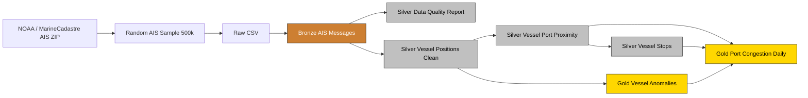

# HarborWatch Local MVP Architecture

## Flow

1. Public AIS data is downloaded from NOAA / MarineCadastre.
2. A reproducible random sample of 500,000 records is created.
3. Raw AIS records are standardized into Bronze.
4. Bronze records are profiled for data quality.
5. Silver clean positions classify each row as valid or rejected.
6. Valid positions are enriched with nearest-port distance.
7. Vessel stop episodes are detected near ports.
8. Gold tables are generated for congestion metrics and vessel anomalies.

## Current Scope

This diagram represents the local MVP.

The AWS lakehouse architecture will extend this flow using:

- Amazon S3
- AWS Glue
- Apache Iceberg
- Glue Data Catalog
- Athena
- Step Functions
- CloudWatch
- Terraform
